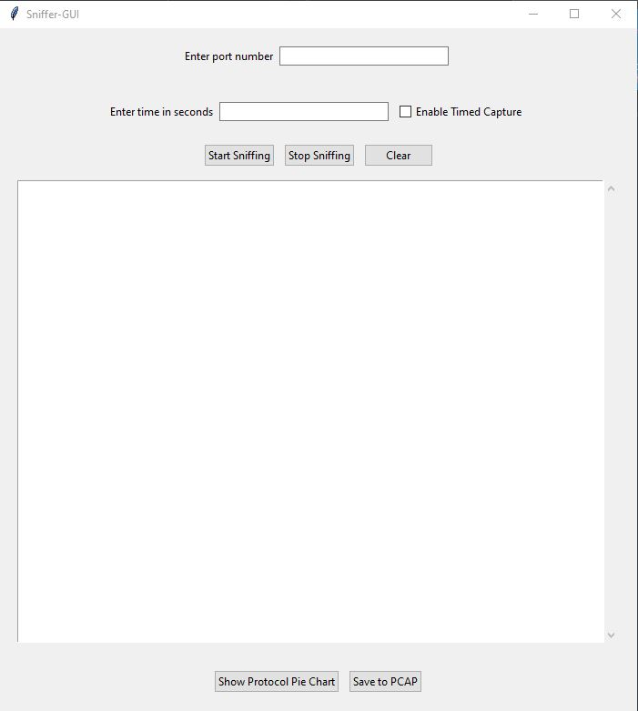

# Sniffer-GUI

A simple Python-based GUI packet sniffer built using **Scapy** and **Tkinter**.  
It allows live network traffic capture with optional port filtering and timed capture.

---

## Features

- ✅ **Live packet sniffing**
- ✅ **Optional port filtering** (TCP/UDP)
- ✅ **Timed capture** mode
- ✅ **Real-time output display**
- ✅ **Save captures as `.pcap` files**
- ✅ **Protocol Summary Pie Chart**
- ✅ **Clear/reset session data**

---

## Requirements

- Python 3.x  
- `scapy`  
- `tkinter` (usually included with Python)
- `matplotlib`

Install dependencies via pip:

```bash
pip install scapy matplotlib
```

>  Note: Run as administrator/root if needed to access network interfaces.

---

##  How to Use

1. Run the script:

    ```bash
    python sniffer_gui.py
    ```

2. (Optional) Enter a **port number** if you want to filter by port.

3. (Optional) Enter a **time duration** in seconds and check the **"Enable Timed Capture"** box.

4. Click **Start Sniffing** to begin.

5. Click **Stop Sniffing** to end early (if not using timed mode).

6. Click **Save to PCAP** to export the captured packets.

7. Use **Clear** to stop sniffing and reset the UI and data.

---

## Output Info

The sniffer supports and displays:
- ARP
- ICMP
- TCP & UDP (with source/destination ports)
- DNS queries

Captured packets are stored in memory and can be saved in `.pcap` format for later analysis in tools like Wireshark.

## Screenshots

### Main Window


### Protocol Distribution Pie Chart


## Notes

- This tool is for educational or testing purposes on networks you own or are authorized to monitor.
- Packet sniffing may require elevated privileges depending on your OS.
